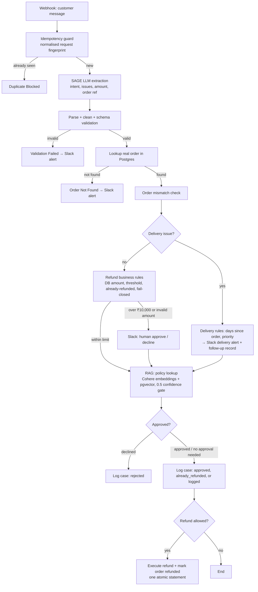

# SAGE — AI Customer Operations Agent

SAGE is an AI-powered customer support workflow built in **n8n** for *Meridian Commerce*, a fictional electronics e-commerce company. It reads an incoming customer message, uses an LLM to work out what the customer wants, checks every claim against the real order database, applies deterministic business rules, and routes high-value refunds to a human in Slack before any money moves.

The design principle throughout: **the LLM interprets, but code and the database decide.**

---

## Architecture

---

## What each stage does

| Stage | Purpose |
|---|---|
| **Idempotency guard** | Fingerprints each request (email + message, trimmed, whitespace-collapsed, lowercased) and blocks exact retries before any LLM call or side effect. |
| **SAGE extraction** | An LLM (OpenAI) returns structured JSON: intent (9 allowed values), issue types, description, order reference, stated amount. |
| **Parse, clean, validate** | Safely parses the LLM output (tolerates code fences and stray text), normalises amounts (`₹1,25,000`, `65k`, `1.5 lakh`, `Rs. 500`), and validates against fixed allowed lists. LLM output is treated as untrusted input. |
| **Database truth** | Looks up the customer's real order in Postgres. The refund amount always comes from the database, never from the customer's claim. |
| **Order mismatch check** | Normalises the order number the customer mentioned and flags it for the approver if it doesn't match the real order. |
| **Business rules** | Deterministic: refunds above ₹10,000 need human approval; an invalid amount always goes to a human (fail closed); an order can only be refunded once. |
| **Human in the loop** | Slack message with customer, order, amount, reason, and what the customer said; the workflow pauses until Approve or Decline. |
| **RAG policy lookup** | Embeds the complaint (Cohere), finds the closest of 6 policy documents with pgvector cosine similarity, and only trusts matches ≥ 0.5. Falls back gracefully if the embedding API fails. |
| **Audit trail** | Every case is logged to `support_cases` with an outcome status; every refund in `refund_actions` links back to its case via `case_id`. |

---

## Safety design (defence in depth)

A double refund is prevented at three independent levels:

1. **Business rules** detect an order whose status is already `refunded`.
2. **The refund gate** only executes if the order isn't already refunded.
3. **The database** enforces it: a partial unique index (`one_refund_per_order`) makes a second refund row for the same order impossible, even if the workflow logic ever failed.

The refund insert and the order status update run as **one atomic SQL statement** (a CTE), so they either both happen or neither does.

---

## Tech stack

- **n8n** (cloud): workflow orchestration
- **OpenAI**: intent and entity extraction
- **Cohere**: text embeddings
- **Supabase Postgres + pgvector**: orders, cases, actions, and policy vectors
- **Slack**: approval requests and operational alerts

### Data model

| Table | Holds |
|---|---|
| `customers`, `orders` | Source of truth for customers, amounts paid, and order status |
| `processed_requests` | Request fingerprints for idempotency |
| `support_cases` | One row per handled request, with intent, amounts, decision, policy match, and status |
| `refund_actions` | Executed refunds, linked to `support_cases` by `case_id` |
| `delivery_followups` | Delivery escalations with priority and recommended action |
| `policy_chunks` | 6 policy documents with their embeddings |

---

## Testing and evaluation

### Intent classification eval

A separate evaluation workflow runs a labelled set of messages through the real extraction prompt and scores the results.

| Run | Result |
|---|---|
| Baseline (20 cases, all 9 intents, incl. Hinglish) | **17/20 (85%)**, with every order-related intent correct |
| After fixing the prompt | **20/20** |
| With 6 held-out cases written after the fix | **26/26 (100%)** |

**Root cause of the misses:** the system prompt itself listed store questions (e.g. payment methods) as examples of `unrelated`. Redefining `general_question`, `other`, and `unrelated` fixed it. The held-out cases share no wording with the prompt's examples, to check the fix generalises rather than memorising the test.

*Caveat:* 26 cases is a small set, and LLM output varies between runs. A production eval would use hundreds of real, labelled tickets and run repeatedly.

### Bugs found through edge-case testing

| Bug | Impact | Fix |
|---|---|---|
| Same order could be refunded repeatedly (one order had 5 refunds) | Money loss | Three-level protection above |
| n8n's comma-separated query parameters split text at commas; the idempotency guard only compared text up to the first comma | Duplicates missed, new requests wrongly blocked | Pass parameters as real arrays |
| Unknown customer email produced an empty record that flowed toward the refund step | Near money loss | Explicit "order found" gate + Slack alert |
| Blank message with subject "Refund request" passed validation (the LLM even invented a description) | Auto-refund with no reason | Validate the original message, not the LLM's summary |
| `"65k"` parsed as 65 and `"Rs. 500"` as 0.5 | Wrong recorded claims | Unit-aware amount parsing |
| Strict `!==` compared a string order ref to a numeric DB id | False mismatch warnings | Normalise to numbers before comparing |
| Trailing spaces / capital letters bypassed the duplicate guard and customer lookup | Duplicate processing, missed customers | Normalise fingerprints; case-insensitive email match |

---

## Known limitations

- **Single intent per message.** A "late *and* damaged" complaint is handled as one primary intent. The approver sees the full description in Slack, but only one pipeline acts.
- **Most recent order only.** The customer lookup matches their latest order; complaints about older orders are flagged by the mismatch check rather than resolved automatically.
- **Full refunds only**, one per order. Partial refunds aren't supported.
- **Policy coverage gap.** Hardware-fault complaints consistently score below the 0.5 confidence threshold (≈0.32–0.37), pointing to a missing warranty/malfunction policy.
- **Delivery follow-ups link by `order_id`, not `case_id`**, because they're saved in a parallel branch before the case is logged.
- **The request fingerprint is normalised text, not a cryptographic hash**, so the dedupe table stores message content.
- **Fictional data.** Tested with seeded customers and orders, not live traffic.

## Next steps

- Multi-intent extraction so each part of a complaint reaches the right pipeline
- Store a SHA-256 hash in the dedupe table instead of message text
- Move the delivery follow-up after case logging so it links by `case_id`
- Add a warranty/malfunction policy and calibrate the RAG threshold on real labelled tickets
- Expand the eval set and run it automatically after every prompt change

---

## Repository contents

- `sage-workflow.json`: the main n8n workflow (exported; credentials not included)
- `sage-eval-workflow.json`: the evaluation workflow
- `README.md`: this file

To run it yourself: import the workflows into n8n, create the Postgres tables above (with the `pgvector` extension), and add your own OpenAI, Cohere, Postgres, and Slack credentials.
